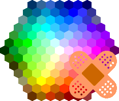
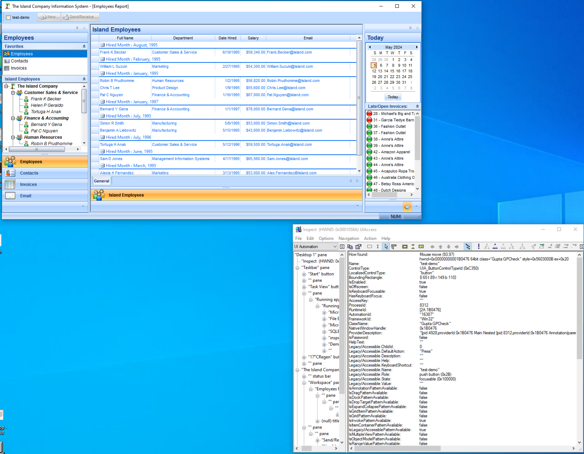
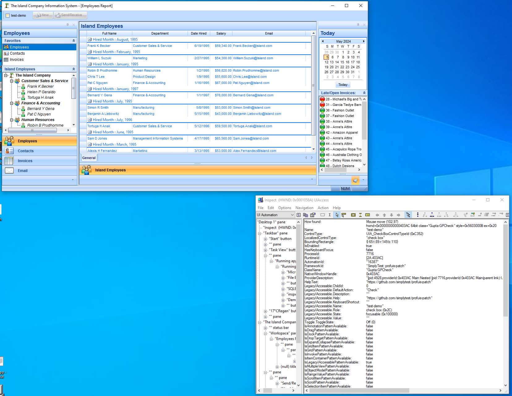

    

## 👋 Introduction

Applications that leverage [ProfUI](http://www.prof-uis.com/) components (such as Win32 Applications developed with [Team Developer](https://www.opentext.com/products/gupta-team-developer)) are not accessibility friendly.

Their checkboxes and radio-buttons lack proper support for the Windows Accessibility Services because their togglable controls are implemented as buttons with custom rendering under the hood, as such, the accessibility services detect them as buttons.

This project aims to fix this by patching the controls window procedure to return a custom accessibility provider.

## 🖼️ Example

| Before               | After               |
| -------------------- | ------------------- |
|  |  |

_The above comparison shows one of the default TD7.5 demo applications before and after applying our patch_ 

## 🔍 Resources

The [data](data/) folder houses the IDA-Pro Database used to reverse engineer the <kbd>ProfUIS288u_td75.dll</kbd>.
